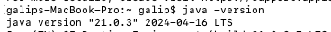

Java Version: 10

JEP: 322

Time-Based Release Versioning
--

Before Java 10, Java used feature-driven versioning with irregular release cycles.
This feature added release date in Java 10.

This change made Java releases more predictable with a consistent release cadence.

General format introduced in this feature:
```bash
$FEATURE.$INTERIM.$UPDATE.$PATCH
```

* FEATURE --> Major Java release
* INTERIM --> Interim feature release
* UPDATE --> Security and bug fix updates
* PATCH --> Emergency patches (usually omitted when 0)

With this model:
* Java releases occur on a regular 6-month schedule

```bash
$ java -version
java version "10.0.2" 2018-07-17
```

What this means?
- 10 --> Feature release
- 0 --> Interim version
- 2 --> Update version
- 2018-07-17 --> Release date

If this version is Long-Term Support, we will see LTS like in java 21.

