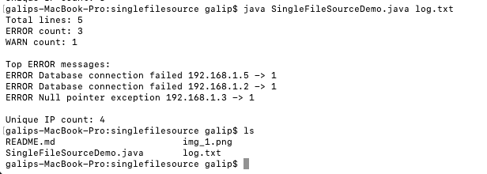

Java Version: 11

JEP: 330

# Launch Single-File Source-Code Programs

---


This feature allows developers to run a single Java source file directly using the `java` command.

It enables Java to be used for:

* quick scripts
* small utilities
* rapid prototyping

In this package, I added a simple script to analyze log files.

Simply run:

`java SingleFileSourceDemo.java log.txt` 

and this will produce the following output:



JVM will:
* compile the source file
* run the compiled code
* not generate `.class` files on disk

No `.class` files are generated on disk;
the compiled bytecode lives only in memory and is discarded when the JVM process terminates.

This behavior is implemented using an in-memory compilation process 
and a custom class loading mechanism instead of reading `.class` files from disk.

If we run this using `javac`:

* Traditional java workflow:
```bash
.java → javac → .class (disk) → JVM → memory
```

With JEP 330:

```bash
.java → compile → bytecode (memory) → JVM
```

Internally, the java launcher uses the Java Compiler API to compile the source code
and then loads the compiled bytecode directly via a ClassLoader without interacting with the file system.

This feature improves developer experience by:

* reducing the need to build and run a separate JAR
* simplifying the development workflow
* making it easier to experiment and test ideas

Limitations:
--
* Only single file is supported
* Not suitable for large applications
* No external dependencies
* Startup time includes compilation overhead


